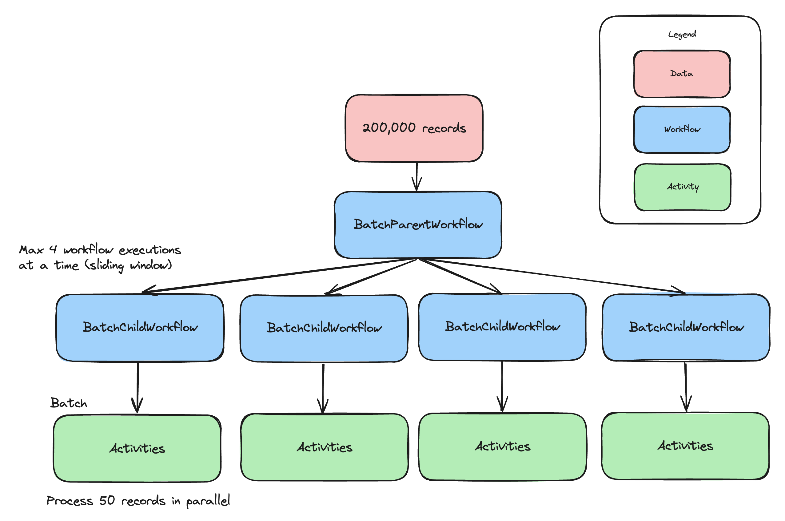

# Batch Processing Sample

Takes a list of words (words_alpha.txt) and processes them (converts them to uppercase) in batches of 50. Each batch is processed in parallel executing child workflows. A maximum of 4 child workflows can be executed in parallel.



## Configuration

The sample is configured by default to connect to a [local Temporal Server](https://docs.temporal.io/cli#starting-the-temporal-server) running on localhost:7233.

To instead connect to Temporal Cloud, set the following environment variables, replacing them with your own Temporal Cloud credentials:

```bash
TEMPORAL_ADDRESS=testnamespace.sdvdw.tmprl.cloud:7233
TEMPORAL_NAMESPACE=testnamespace.sdvdw
TEMPORAL_CERT_PATH="/path/to/file.pem"
TEMPORAL_KEY_PATH="/path/to/file.key"
````

## Run a Workflow

Start a worker:

```bash
./gradlew -q execute -PmainClass=io.temporal.samples.batchprocessing.Worker
```

Heck, run a whole bunch of workers (you'll need a bunch to keep [sync match rate](https://community.temporal.io/t/suggested-metrics-to-autoscale-temporal-workers-on/5870/3) high): 
```bash
# -Parg is the metrics port number to listen on
for i in {8085..8100}; do 
    ./gradlew -q execute -PmainClass=io.temporal.samples.batchprocessing.Worker -Parg=$i < /dev/null > "temporal_batch_output_$i.txt" 2>&1 &
done
wait
```

Start an execution (the `arg` parameter is the number of records to process):

```bash
# process 20000 records (warning: takes 15+ minutes to finish executing)
./gradlew -q execute -PmainClass=io.temporal.samples.batchprocessing.Caller -Parg=200000
```

## Tweak Configuration

`BatchParentWorkflowImpl.java` contains

```
    // process x records in a single batch (parallel activity executions)
    private static final int BATCH_SIZE = 50;

    // run up to x child workflows in parallel
    private static final int WINDOW_SIZE = 4;

    // continue as new every x workflow executions (to keep event history size small)
    private static final int CONTINUE_AS_NEW_THRESHOLD = 500;
```

`Worker.java` contains
```
    // set activities per second across *all* workers
    // prevents resource exhausted errors

    WorkerOptions options =
        WorkerOptions.newBuilder().setMaxTaskQueueActivitiesPerSecond(150).build();
```

## metrics
See 'Worker Tuning Experiment' google doc for more details

Raw notes

https://claude.ai/chat/b3eb476e-8a36-48c6-a979-b64dae8a54a2
prometheus in ~/Download
runs on 9090

prometheus.yml
```yaml
    static_configs:
      - targets: ["localhost:8076","localhost:8085","localhost:8086","localhost:8087","localhost:8088","localhost:8089",
      "localhost:8090","localhost:8091","localhost:8092","localhost:8093","localhost:8094","localhost:8095",
      "localhost:8096","localhost:8097","localhost:8098","localhost:8099"]
```

Scraping
8078
8085 8099

grafana in downloads bin/grafana server
http://localhost:3000/
password admin lga

sdk java github dashboard didn't work immediately
needed to go to each dashboard hit 'builder' then run queries
exported result to ~/Downloads fixed
Schedule to start latencies are called "Activity Task Backlog By Activity Type" in dashboard

## worker tuning

TODO